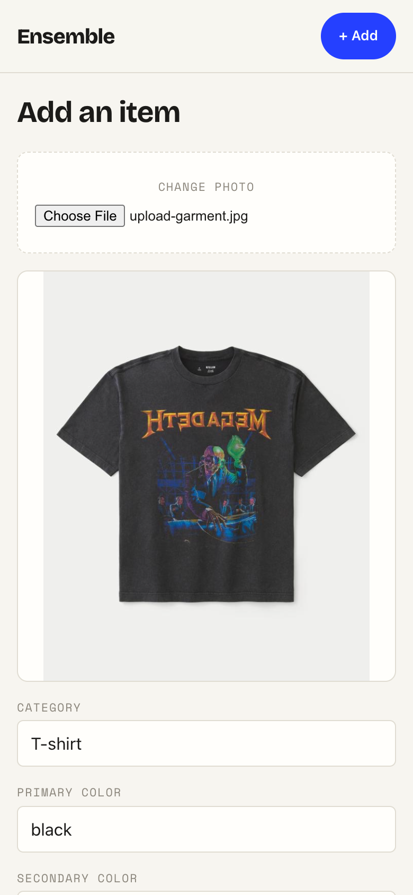
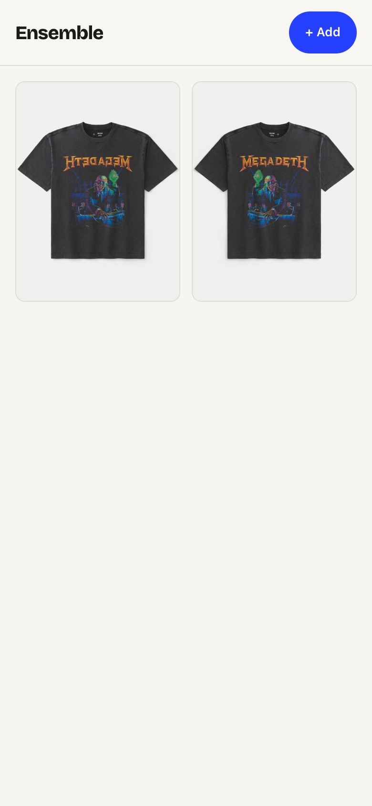
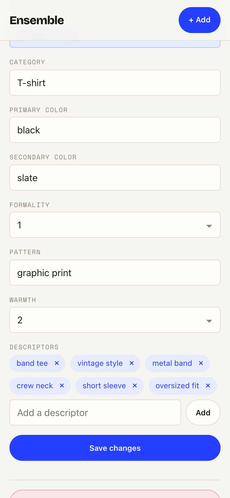

# Task 05 Proofs — End-to-end against the live backend + docs

## Task Summary

This task ties the Wardrobe UI to the running stack and records the acceptance
evidence (spec Success Metrics 1–4): a live run against Spring + DynamoDB Local +
**real Claude Haiku tagging** exercising all three acceptance criteria at a phone
viewport, the green quality gate, and a README section so a new developer can run
the slice.

## What This Task Proves

- **Headline flow, live:** on a 390px browser, a photo is auto-tagged by a real
  Haiku vision call, edited, saved, and then appears in the grid.
- **Grid + maintenance, live:** the grid lists owned items with photos; item edit
  (`updateTags`) and delete (`deleteItem`) both complete end to end.
- **Quality gate:** the full Vitest suite, ESLint, and the production build are all
  green.
- **Docs:** `README.md` gains a "Wardrobe UI" section (routes, how to run in dev,
  and that browsing/editing needs no Claude key).

## Evidence Summary

- Live E2E driver output shows the wardrobe going 1 → 2 items on add and 2 → 1 on
  delete, with a real suggested category of `"T-shirt"`.
- Screenshots capture the live auto-tagged add form, the populated grid, and the
  editable detail (with rich AI descriptors) at 390px.
- The quality-gate capture shows 56 tests passing, lint clean, build succeeding.
- No secrets are present in any proof artifact.

## Artifact: Live end-to-end transcript

**What it proves:** All three acceptance criteria run against the real backend +
DynamoDB + live Haiku tagging, with no request mocking.

**Why it matters:** This is the spec's headline success metric — the app works on
the real stack, not just against mocks.

**Artifact path:** `docs/specs/04-spec-wardrobe-ui/04-proofs/04-task-05-live-e2e-transcript.txt`

**Result summary:** Add → live auto-tag (`category: "T-shirt"`) → save → grid count
1→2; edit (`secondaryColor → "slate"`, "Changes saved"); delete → grid count 2→1.
The run cleaned up after itself.

## Artifact: Live auto-tag on add (real Haiku)

**What it proves:** Selecting a photo triggers a genuine Claude Haiku vision call
whose suggestion pre-fills the editable form.

**Why it matters:** This is spec acceptance criterion 1, proven with the real AI
rather than a stub.

**Artifact path:** `docs/specs/04-spec-wardrobe-ui/04-proofs/04-task-05-live-add-autotag.png`

**Result summary:** The uploaded garment shows a live suggestion — Category
`T-shirt`, Primary color `black` — in the editable form.



## Artifact: Grid after live add

**What it proves:** The newly created item is persisted and shows in the grid
alongside the pre-existing item.

**Artifact path:** `docs/specs/04-spec-wardrobe-ui/04-proofs/04-task-05-live-grid.png`

**Result summary:** Two garment thumbnails render in the mobile grid after the add.



## Artifact: Live detail edit (rich AI tags + saved edit)

**What it proves:** The detail screen loads the persisted item with its full live
tag set (descriptors `band tee`, `vintage style`, `metal band`, `crew neck`,
`short sleeve`, `oversized fit`), and an edit (`secondaryColor → slate`) saves via
`updateTags`.

**Artifact path:** `docs/specs/04-spec-wardrobe-ui/04-proofs/04-task-05-live-edit-saved.png`

**Result summary:** The editable detail form reflects the live AI tags and the
saved `slate` secondary color; no wear-history is shown.



## Artifact: Frontend quality gate

**What it proves:** The whole front-end suite, lint, and build pass (Success
Metric 4).

**Why it matters:** This is the pre-merge quality bar for the slice.

**Artifact path:** `docs/specs/04-spec-wardrobe-ui/04-proofs/04-task-05-quality-gate.txt`

**Command:**

```bash
cd frontend && npm run test -- --run && npm run lint && npm run build
```

**Result summary:** 56 tests pass across 8 files; ESLint exits 0; the build emits
assets into `src/main/resources/static/`.

## Artifact: README "Wardrobe UI" section

**What it proves:** A new developer can run the UI in dev and understands the
routes and the no-key-needed-to-browse behavior.

**Why it matters:** Documentation is required to run and demo the slice.

**Artifact path:** `README.md` (new "Wardrobe UI" section)

**Result summary:** Documents the three routes, the `docker compose` + `bootRun` +
`npm run dev` steps, and that only live auto-tagging needs a Claude key.

## Reviewer Conclusion

The Wardrobe UI is complete and demoable on the real stack: the headline add flow
works with live AI tagging, the grid and item maintenance (edit + delete) work end
to end, the quality gate is green, and the README documents how to run it — with
no secrets in any artifact.
