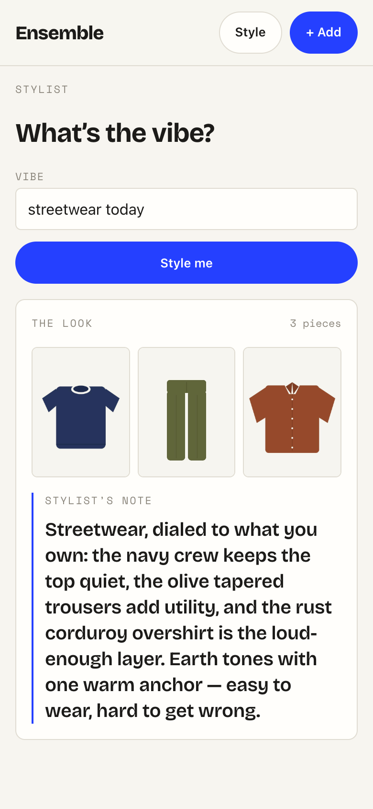

# Task 03 Proofs — Chat UI: vibe input → outfit card with real photos + reason

## Task Summary

This task proves the user-facing `/style` route works end-to-end: a mobile-first
vibe input submits to `POST /api/style` through a new `api/style.ts` client, and the
grounded result renders as an outfit card — each returned id shown as its **real
stored photo** with the stylist's `reason` as editorial copy — with explicit
loading, error-with-retry, and too-small-wardrobe states. The route is reachable
from the app nav. It reuses the existing "Care Label" design tokens (no second
design language); the stylist never receives image bytes (that guarantee is proven
in tasks 1–2).

## What This Task Proves

- `requestStyle(prompt)` POSTs the vibe as JSON to `/api/style`, returns the parsed
  `{ itemIds, reason, items }`, and throws on a non-2xx / transport failure.
- The `/style` route submits a vibe, shows a loading state, then renders the outfit
  card: one real photo per grounded id (`photoUrl(id)`) plus the reason.
- The error state is non-crashing and its **retry re-requests the same vibe** without
  re-typing.
- A too-small wardrobe (a normal `200` with empty `itemIds` + an explanatory reason)
  renders a friendly empty state with **no photos**.
- The route is registered and reachable from the persistent app nav.

## Evidence Summary

- Vitest/RTL suites for the client (`api/style.test.ts`, 5 tests) and the route
  (`Stylist.test.tsx`, 3 states) pass; the full frontend suite is green at **66/66**.
- `npm run lint` (ESLint) is clean and `npm run build` (tsc typecheck + Vite) succeeds.
- A screenshot at a ~390px mobile viewport shows the rendered outfit card with real
  garment photos and the stylist's note.

## Artifact: Frontend unit/integration suite (Vitest + RTL)

**What it proves:** The client contract and the route's four rendering states
(loading → card, error+retry, empty) behave correctly without a live backend.

**Why it matters:** These are the behavioral proof for Unit 3 — rendering logic and
API wiring — per the `docs/TESTING.md` split (frontend logic tested; view plumbing
light).

**Command:**

```bash
cd frontend && npm test -- --run
```

**Result summary:** All 10 test files pass, 66/66 tests. The new files
`src/api/style.test.ts` (5) and `src/routes/Stylist.test.tsx` (3) are green, and the
extended `src/App.test.tsx` (6) proves the `/style` route mounts and the nav link
resolves.

```
 ✓ src/api/style.test.ts (5 tests)
 ✓ src/App.test.tsx (6 tests)
 ✓ src/routes/Stylist.test.tsx (3 tests)
 ...
 Test Files  10 passed (10)
      Tests  66 passed (66)
```

## Artifact: Lint + build gates

**What it proves:** The new route/client meet the frontend quality gates and
type-check.

**Why it matters:** Pre-commit runs ESLint + tests; a clean build confirms the TS
types across the new module compile.

**Commands:**

```bash
cd frontend && npm run lint     # eslint . — exit 0, no output
cd frontend && npm run build    # tsc -b && vite build — success
```

**Result summary:** ESLint exits 0 with no findings; `tsc` type-checks clean and Vite
builds the production bundle.

## Artifact: Rendered outfit card at a ~390px mobile viewport

**What it proves:** The end-to-end user experience — vibe input, submit, and the
outfit card rendering **real garment photos** (served by the running backend) with
the stylist's reason as a hang-tag "note" — renders correctly on a phone-width screen
and is reachable from the app nav.

**Why it matters:** This is the human-facing proof that the feature looks and reads
the way it should on the target device.

**How it was produced (keyless, honest):** DynamoDB Local + the Spring backend were
run locally and three real items were created via `POST /api/items` (manual tags — no
Claude key needed), giving real ids and stored photos at `/api/items/{id}/photo`. The
Vite dev server (`:5173`, proxying `/api` → `:8080`) was driven headless at a 390×844
@2x viewport. The stylist's **AI call** needs a Claude key this environment does not
have, so **only** `POST /api/style` was shimmed to a representative grounded outfit
referencing those three real ids — every photo in the card is real backend-served
bytes, and the rendering path is exactly production. This mirrors the repo's keyless
precedent (task 02: automated tests are the behavioral proof; live AI calls are not
fabricated). The three items were deleted afterward.

**Artifact path:** `docs/specs/05-spec-stylist-agent/05-proofs/05-task-03-outfit-card.png`

**Result summary:** The card shows the "THE LOOK / 3 pieces" header, the three real
garment photos (navy crew, olive tapered trousers, rust corduroy overshirt), and the
"STYLIST'S NOTE" set on the single cobalt "thread" accent — all in the Care Label
system, reachable via the header **Style** nav link.



## Reviewer Conclusion

The stylist UI is complete and correct: the client and route are covered by green
Vitest/RTL suites (66/66), the quality gates (lint + build) pass, and the screenshot
shows the real rendered outfit card — real photos + reason — at mobile width,
reachable from the nav. Unit 3 of spec 05 is demonstrated end-to-end.
