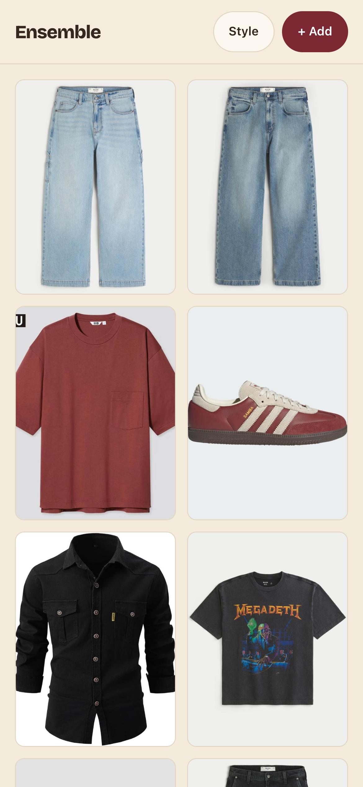
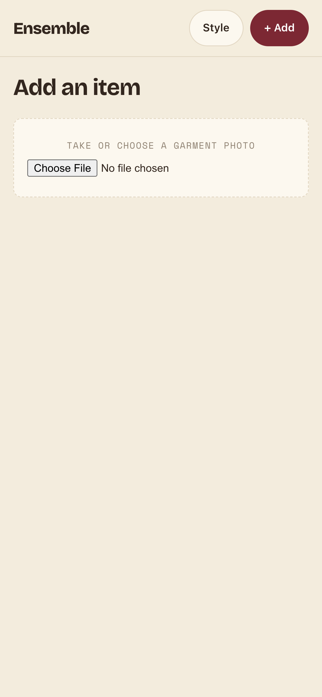
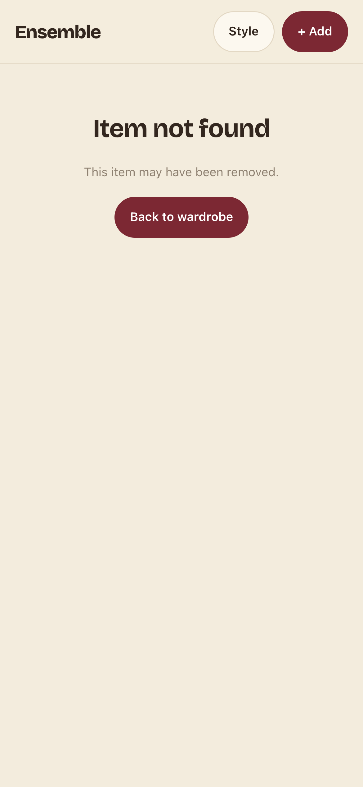
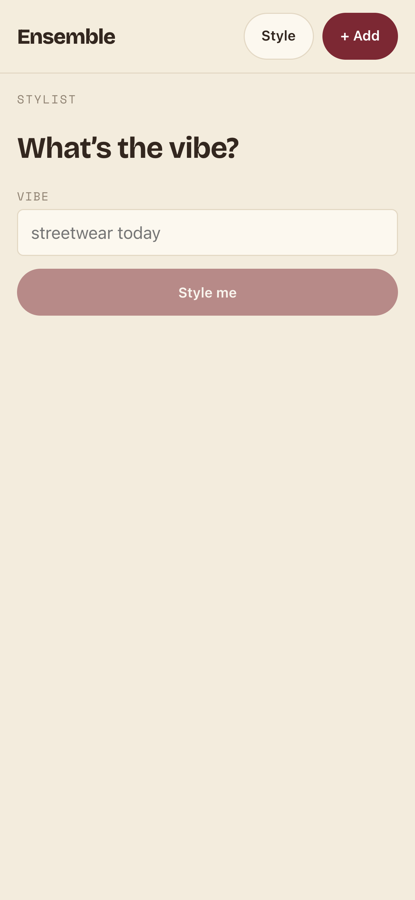

# Task 01 Proofs — Repalette the design system (cobalt → maroon/beige)

## Task Summary

This task proves the whole Ensemble UI recolors from the cobalt "Care Label"
palette to the maroon/beige handoff palette by editing **only** design tokens:
the 7 base color tokens in the single `:root` block of `frontend/src/index.css`
plus the `theme-color` meta in `frontend/index.html`. No component markup, class
names, `--danger*`, or non-color tokens change; the recolor propagates to every
screen through the existing token references and `color-mix()` shades.

## What This Task Proves

- The 7 base color tokens now hold the maroon/beige values; zero cobalt/cream
  values remain in `index.css`.
- The browser chrome color (`theme-color` meta) matches the new paper color.
- `--danger` / `--danger-soft` and all non-color tokens are untouched.
- All four existing screens (`/`, `/add`, `/item/:id`, `/style`) render in the
  new palette with no layout or behavior change.

## Evidence Summary

- Old-value grep returns **no matches** (no cobalt/cream left).
- New-value grep returns the **7** replaced tokens at `index.css:10–16`.
- `theme-color` meta is `content="#F3ECDD"`.
- `git diff` touches exactly **8 lines** — 7 token values + 1 meta line — and no
  `.tsx`/markup.
- Screenshots of all 4 screens show maroon accents on beige paper.

## Artifact: No stale cobalt/cream values

**What it proves:** No old palette values survive in the stylesheet.

**Why it matters:** Success Metric 2 requires zero occurrences of the 7 old
cobalt/cream hex values.

**Command:**

```bash
grep -nE "#2540ff|#e7ebff|#f7f5f0|#fffefb|#1c1b19|#8a857b|#e0dcd2" frontend/src/index.css
```

**Result summary:** No matches — every old value is gone.

```
(no matches)
```

## Artifact: The 7 maroon/beige tokens are present

**What it proves:** The base palette holds the exact handoff values.

**Why it matters:** Success Metric 3 requires the 7 replaced tokens to exist in
`:root` with the specified values.

**Command:**

```bash
grep -niE "#f3ecdd|#fcf8ef|#33271f|#8f8272|#e3d8c4|#7c2833|#ecd9d3" frontend/src/index.css
```

**Result summary:** All 7 tokens present at lines 10–16.

```
10:  --paper: #f3ecdd;
11:  --paper-raised: #fcf8ef;
12:  --ink: #33271f;
13:  --muted: #8f8272;
14:  --hairline: #e3d8c4;
15:  --accent: #7c2833;
16:  --accent-soft: #ecd9d3;
```

## Artifact: theme-color meta updated + danger tokens untouched

**What it proves:** The browser chrome color matches the new paper; the danger
palette is left alone.

**Why it matters:** The `theme-color` meta duplicates the paper color (spec Unit
1); `--danger*` must remain unchanged (spec Goal + non-goals).

**Commands:**

```bash
grep -niE "theme-color" frontend/index.html
grep -nE -- "--danger" frontend/src/index.css
```

**Result summary:** Meta is `#F3ECDD`; `--danger: #b00020` and
`--danger-soft: #fbe7ea` are unchanged at lines 17–18.

```
6:    <meta name="theme-color" content="#F3ECDD" />
17:  --danger: #b00020;
18:  --danger-soft: #fbe7ea;
```

## Artifact: Diff is a pure token swap

**What it proves:** Only the 7 token values + the meta line changed — no markup,
class names, or behavior.

**Why it matters:** Spec requires zero component/behavior change (Unit 1 FR,
Success Metric 4).

**Command:**

```bash
git diff frontend/src/index.css frontend/index.html
```

**Result summary:** 8 lines changed total — 7 CSS token values and 1 HTML meta
value. Nothing else.

```diff
-  --paper: #f7f5f0;            +  --paper: #f3ecdd;
-  --paper-raised: #fffefb;     +  --paper-raised: #fcf8ef;
-  --ink: #1c1b19;              +  --ink: #33271f;
-  --muted: #8a857b;            +  --muted: #8f8272;
-  --hairline: #e0dcd2;         +  --hairline: #e3d8c4;
-  --accent: #2540ff;           +  --accent: #7c2833;
-  --accent-soft: #e7ebff;      +  --accent-soft: #ecd9d3;
-  <meta name="theme-color" content="#F7F5F0" />
+  <meta name="theme-color" content="#F3ECDD" />
```

## Artifact: Screenshots — all four screens in maroon/beige

**What it proves:** The recolor is visible across every existing screen.

**Why it matters:** Success Metric 1 requires all four screens to render in
maroon/beige. Captured from the Vite dev server (iPhone 14 viewport) at
`http://localhost:5173`.

**Result summary:** Beige paper, maroon fills (`+ Add`, primary buttons) with
cream text, dark-ink titles, and mono muted labels across all screens. The
`/item/:id` error state and the `/style` disabled button also render in-palette.

### `/` — wardrobe grid

**Artifact path:** `screenshots/01-home-wardrobe.png`



### `/add` — add item

**Artifact path:** `screenshots/02-add-item.png`



### `/item/:id` — item detail (not-found state)

**Artifact path:** `screenshots/03-item-detail.png`



### `/style` — stylist

**Artifact path:** `screenshots/04-stylist.png`



## Reviewer Conclusion

Editing only the 7 base tokens and the `theme-color` meta recolors the entire app
to maroon/beige with a pure 8-line diff and no markup or behavior change. All four
screens render in the new palette, and the danger palette is preserved. Task 1.0
is complete; the on-accent tokenization and the green test suite are proven in
Task 2.0.
