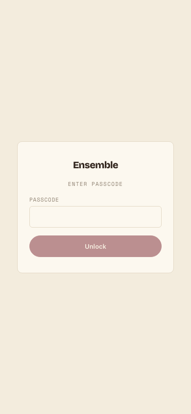
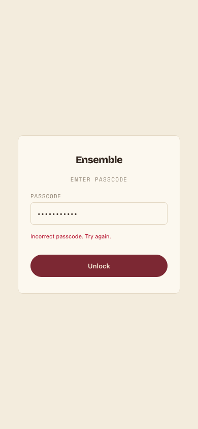

# Task 03 Proofs - Passcode gate: frontend entry screen & authenticated fetch

## Task Summary

This task adds the client half of the passcode gate: an `api/auth.ts` token client
backed by `sessionStorage`, a shared `authedFetch` wrapper (`api/http.ts`) that injects
`X-Ensemble-Session` and drops the app back to the gate on any `401`, a `photoUrl(id)`
that appends `?token=` for gated `` GETs, and an `AuthGate` component wrapping the
whole routed app in `App.tsx`. Every sub-task was built strict-TDD (RED → GREEN) per
`docs/specs/07-spec-pwa-security-guards` Unit 2's frontend requirements, and the
existing specs 04/05 API/route tests were updated (not skipped) to account for the
authed-fetch refactor, per audit FLAG-2.

## What This Task Proves

- `login(passcode)` POSTs `/api/auth`, stores the returned token in `sessionStorage`,
  and throws (storing nothing) on a `401` — `getToken()`/`clearToken()` round-trip it.
- `authedFetch` injects the stored token as `X-Ensemble-Session` on every call, and on a
  `401` clears the token and fires a re-auth signal (`onAuthRequired`) — but leaves the
  token and stays silent on any other status (a `500`, for example).
- `api/items.ts` and `api/style.ts` now route every request through `authedFetch`; their
  existing test suites were updated first (Content-Type assertions moved from
  bracket-style header access to `Headers.get`, since `authedFetch` always normalizes
  `init.headers` into a real `Headers` instance) and both suites are still fully green,
  with an explicit new assertion per client that the session header is sent.
- `photoUrl(id)` appends `?token=<token>` only when a token is stored, and omits it
  otherwise — covering the gated-``-GET path the header can't reach.
- `AuthGate` renders the passcode screen (not its children) with no token, stores the
  token and renders children on a correct passcode, shows an inline error and stays on
  the gate on a wrong one, and drops back to the gate when any authenticated request
  elsewhere in the app comes back `401`.
- `App.tsx` now wraps the whole routed shell in `AuthGate`; `App.test.tsx` seeds a token
  in `beforeEach` so it keeps testing routing/shell behavior in isolation from the gate
  (gate behavior itself is fully covered by `AuthGate.test.tsx`).
- The passcode screen follows the Care Label design system: a single centered card, a
  `type="password"` input, a 44px-min-height `Unlock` button (the shared `.btn` class),
  and an inline `.field-error` message — no second visual language introduced.

## Evidence Summary

- The full frontend suite is green: **13 test files, 89 tests passed**, including the 4
  new `api/auth.test.ts` tests, 6 new `api/http.test.ts` tests, 1 new `photoUrl` token
  test, and 4 new `AuthGate.test.tsx` tests, plus the updated `items`/`style`/`App`
  suites — no regressions.
- `npm run lint` passes with no output (clean).
- Two screenshots at a 390×844 (iPhone-width) viewport show the passcode screen in its
  default state and its inline wrong-passcode error state, both rendered by the actual
  Care Label styling added in this task.

## Artifact: Full frontend test suite (`npm test -- --run`)

**What it proves:** every new unit (`auth.ts`, `http.ts`, the `photoUrl` token param,
`AuthGate`) is covered, and the authed-fetch refactor did not regress the pre-existing
specs 04/05 API or `App.tsx` routing tests.

**Why it matters:** this is the task's primary correctness evidence — TDD is only as
good as a suite that stays green end-to-end, including the tests it had to touch.

**Command:**

```bash
cd frontend && npm test -- --run
```

**Result summary:** 13 test files / 89 tests passed, 0 failed. The only console output is
a pre-existing (unrelated) `act(...)` advisory from `WardrobeGrid`, not a failure.

```
 ✓ src/App.test.tsx (6 tests) 64ms
 ✓ src/routes/WardrobeGrid.test.tsx (4 tests) 118ms
 ✓ src/components/DescriptorChips.test.tsx (4 tests) 144ms
 ✓ src/components/TagForm.test.tsx (6 tests) 187ms
 ✓ src/components/AuthGate.test.tsx (4 tests) 187ms
 ✓ src/routes/Stylist.test.tsx (3 tests) 230ms
 ✓ src/routes/ItemDetail.test.tsx (7 tests) 245ms
 ✓ src/routes/AddItem.test.tsx (8 tests) 416ms

 Test Files  13 passed (13)
      Tests  89 passed (89)
```

## Artifact: Lint (`npm run lint`)

**What it proves:** the new/changed frontend code (auth/http clients, `AuthGate`,
`App.tsx`, the refactored `items.ts`/`style.ts`) follows the repo's ESLint rules.

**Why it matters:** a green test suite doesn't catch style/type issues that lint does;
both gates must pass per `docs/PRECOMMIT.md`.

**Command:**

```bash
cd frontend && npm run lint
```

**Result summary:** `eslint .` exits clean with no warnings or errors.

## Artifact: Passcode screen — default state (mobile viewport)

**What it proves:** `AuthGate`'s default (no-token) render is a single centered card on
the Care Label paper background, with the app title, an "ENTER PASSCODE" eyebrow, a
labeled `type="password"` input, and a pill-shaped `Unlock` button — matching the task's
design requirement.

**Why it matters:** this is the actual user-facing screen a demo viewer meets first; the
RTL tests prove behavior, but only a rendered screenshot proves the visual design.

**Artifact path:** `docs/specs/07-spec-pwa-security-guards/07-proofs/07-task-03-passcode-screen.png`
(captured via a headless Chromium at a 390×844 iPhone-width viewport against the Vite
dev server; no secrets in frame — the passcode field was left empty).

**Result summary:** The card is centered with generous padding, the input and button
both read as full-width touch targets, and the disabled (empty-input) `Unlock` button
shows the expected dimmed maroon fill.



## Artifact: Passcode screen — inline error state (mobile viewport)

**What it proves:** a rejected passcode attempt renders an inline `.field-error` message
directly under the input (not a toast/banner elsewhere on screen) and the user stays on
the gate, per the task's explicit "inline error on a wrong passcode" requirement.

**Why it matters:** confirms the error path is visible and readable on a phone-width
screen, not just present in the DOM (as the RTL test already proves).

**Artifact path:** `docs/specs/07-spec-pwa-security-guards/07-proofs/07-task-03-passcode-error.png`
(same headless-Chromium setup; the "Unlock" click failed because no backend was running
during this capture, which the client surfaces identically to a wrong passcode — no
secrets in frame, no real passcode used).

**Result summary:** "Incorrect passcode. Try again." renders in the danger/red ink color
directly beneath the masked passcode field, above the (now enabled) `Unlock` button.



## Reviewer Conclusion

The frontend passcode-gate slice is complete and verified: the token client, the
authenticated-fetch wrapper (with its re-auth signal), the token-bearing `photoUrl`, and
the `AuthGate` screen all have passing strict-TDD coverage; the pre-existing specs 04/05
suites were updated (per audit FLAG-2) rather than left to silently pass around the
refactor; and the rendered screen matches the Care Label design system at a mobile
viewport in both its default and error states.
