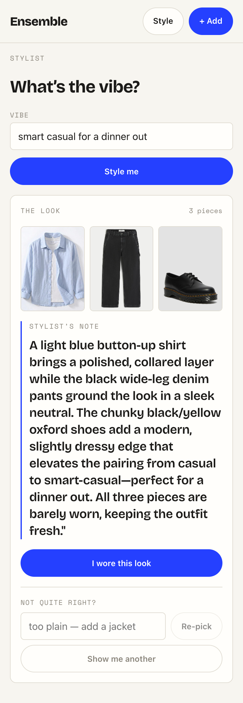
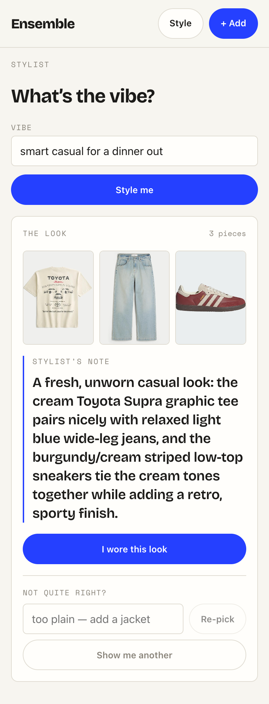

# Task 04 Proofs — Pushback + "Show me another" re-pick UI

## Task Summary

This task closes the re-pick loop on the frontend. After a look renders, the outfit card
now shows a free-text **pushback field** and a **"Show me another"** regenerate button. Both
build the full conversation `history` (the vibe + an assistant summary of each prior pick +
the user's feedback) and re-run `POST /api/style` through an extended
`requestStyle(prompt, history)`, rendering the new look. The server stays stateless — the
client accumulates and resends the thread each turn. Loading, error-with-retry, and
empty-wardrobe states all hold across re-picks; controls disable while a request is in
flight and the prior look stays on screen. Frontend meaningful-logic tests only.

## What This Task Proves

- `requestStyle(prompt, history)` POSTs `{ prompt, history }` when re-picking and stays
  backward compatible (`{ prompt }` only) when no history is given.
- After a look renders, a pushback textbox + "Show me another" button appear.
- **Pushback** sends the newest feedback with the prior vibe + a pick summary as `history`.
- **"Show me another"** sends a canned "show me another" user turn with the full thread.
- The thread **accumulates** across successive re-picks (turn 3 carries all prior turns).
- Re-pick controls **disable while loading** and the previous look stays visible.
- The **error-with-retry** state replays the exact failed turn; the **empty** state still
  renders if a re-pick returns nothing to style.

## Evidence Summary

- The full frontend suite passes — **93 tests / 11 files**; `npm run lint` clean.
- New/updated specs: `api/style.test.ts` (history in the POST body + backward compat, 7),
  `Stylist.test.tsx` (call-shape update + 7 new re-pick cases, 12).
- Live screenshots (390px mobile viewport, Vite dev server proxying `/api` → the running
  backend, live Sonnet 5 stylist) show a rendered look with the pushback field +
  "Show me another", and a **second, different look** after clicking regenerate.

## Artifact: Frontend unit + component tests

**What it proves:** the stateless client contract (`history` in the body) and the whole
re-pick loop UI logic — reveal, pushback, regenerate, thread accumulation, disabled-while-
loading, and the preserved error/empty states.

**Why it matters:** this is the meaningful UI logic for the re-pick side; the thread the
client resends must be exact (the server is stateless and relies on it).

**Command:**

~~~bash
cd frontend && npm test -- --run
~~~

**Result summary:** all 11 files / 93 tests pass, including
`style API client › requestStyle › POSTs the accumulated history…` /
`…omits history when none is given`, and
`Stylist route › reveals a pushback field and a "Show me another" button…` /
`re-picks on pushback…` / `regenerates…` / `threads across two re-picks…` /
`disables the re-pick controls while a re-pick is in flight…` /
`preserves the error-with-retry state on a failed re-pick…` /
`shows the empty state if a re-pick returns nothing to style`.

~~~text
Test Files  11 passed (11)
     Tests  93 passed (93)
~~~

## Artifact: Lint

**What it proves:** the new code meets the repo's eslint flat-config rules.

**Command:**

~~~bash
cd frontend && npm run lint
~~~

**Result summary:** eslint exits clean (no output, status 0).

## Artifact: First look with the re-pick controls (screenshot)

**What it proves:** a rendered look now carries the re-pick affordances — a "Not quite
right?" pushback field (placeholder "too plain — add a jacket"), a **Re-pick** button, and a
**Show me another** button — below the "I wore this look" action.

**Why it matters:** confirms the loop UI renders in the real app against the live stylist,
not just under RTL. The vibe "smart casual for a dinner out" produced a light-blue
button-up + black wide-leg denim + black/yellow oxford shoes.

**Artifact path:** `docs/specs/07-spec-repick-wear-history/07-proofs/assets/stylist-repick-look1.png`

**Result summary:** the outfit card shows the first look (3 pieces) with the stylist's note
and the pushback field + "Show me another" regenerate control at ~390px mobile width.

## Artifact: A different look after re-pick (screenshot)

**What it proves:** clicking **"Show me another"** re-runs `POST /api/style` with the full
thread and renders a **different** grounded look — the core re-pick behavior.

**Why it matters:** confirms the stateless resend + different-look nudge works end-to-end:
the second pick shares no pieces with the first and the stylist's note explains the new
pairing.

**Artifact path:** `docs/specs/07-spec-repick-wear-history/07-proofs/assets/stylist-repick-look2.png`

**Result summary:** the same vibe re-picked to a cream Toyota Supra graphic tee + light-blue
wide-leg jeans + burgundy/cream low-top sneakers — a distinct look from look 1, with the
re-pick controls still present for further iteration.

## Reviewer Conclusion

The re-pick loop is complete on the frontend: the client resends an accumulating,
text-only thread; pushback and "Show me another" both produce grounded, *different* looks;
and the loading / error-with-retry / empty states survive re-picks. All logic is covered by
passing tests and confirmed on screen against the live stylist. No secrets appear in this
proof.
