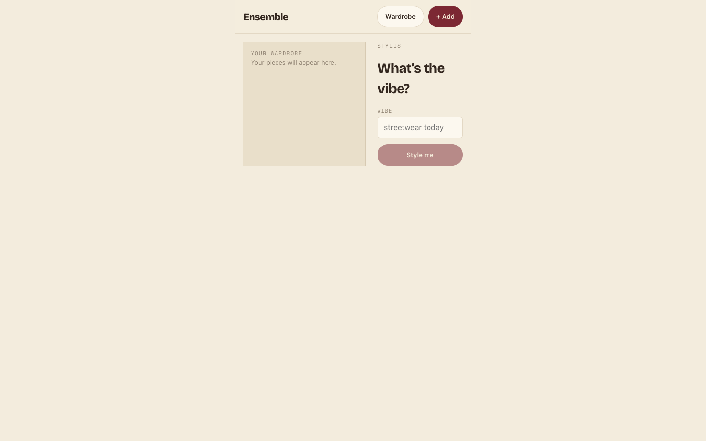
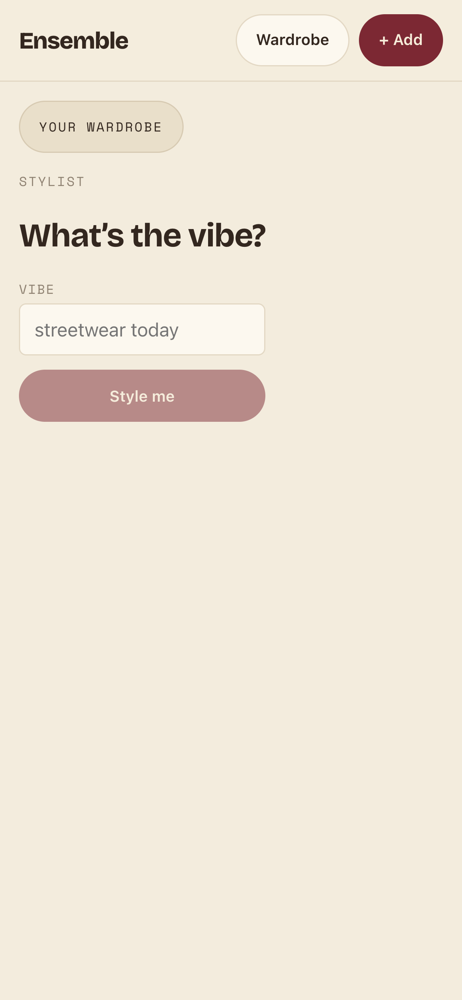
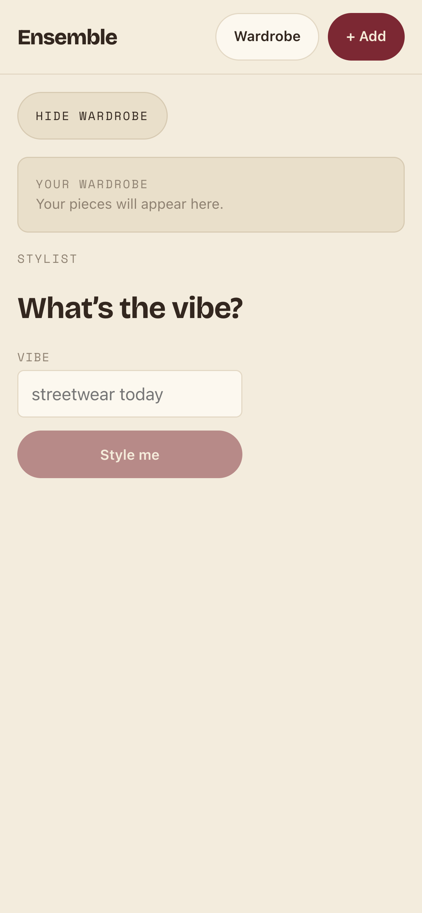

# Task 04 Proofs — Landing-route change + spec-sheet screen shell

## Task Summary

This task proves the stylist is now the app's **landing screen** and the wardrobe grid moved to
`/wardrobe`, with every internal link/redirect migrated so nothing points at the grid via `/`
anymore. It also lays out the **two-pane shell** the spec-sheet UI (task 5.0) will fill: a
`--paper-sunk` wardrobe drawer beside the conversational main column on desktop, collapsing behind
a toggle on narrow viewports. The drawer's contents are a placeholder here (task 5.0 builds the real
`WardrobeDrawer`); this task proves the routing migration and the responsive layout.

## What This Task Proves

- **Landing-route migration (FR U3 routing):** `/` renders the stylist, `/wardrobe` renders the grid; the legacy `/style` redirects to `/`; `AddItem`/`ItemDetail` post-create/-delete redirects and the "Back to wardrobe" link now land on `/wardrobe`. No link is left pointing at the grid via `/`.
- **Two-pane layout (FR U3 layout):** a 250px `--paper-sunk` drawer sits beside the main column on a wide viewport; the header shows the `Ensemble` wordmark + a `Wardrobe` link + `+ Add`.
- **Mobile-first responsiveness (FR U3 responsive):** below 900px the panes stack and the drawer collapses behind a ≥44px toggle (a bottom-sheet-style panel), the touch target satisfied by the `min-height: 44px` pill.
- **No regression:** the full frontend suite stays green after the shared routing change.

## Evidence Summary

- `App.test.tsx` (7 tests) asserts `/` = stylist, `/wardrobe` = grid, `/style` → redirect, and a `Wardrobe` header link at `/wardrobe`.
- `AddItem.test.tsx` + `ItemDetail.test.tsx` redirect/back probes now resolve at `/wardrobe` and pass.
- Full suite: **12 files / 130 tests pass**; `tsc -b` and `eslint` clean.
- Desktop + mobile (collapsed and open) screenshots show the two-pane shell and its responsive collapse.

## Artifact: Routing + shell unit tests

**What it proves:** the landing-route migration is enforced by tests — the stylist mounts at `/`, the grid at `/wardrobe`, `/style` redirects, and downstream screens redirect to `/wardrobe`.

**Why it matters:** a shared routing change is the kind of edit that silently strands a link; the tests lock every entry/redirect to the new map.

**Command:**

~~~bash
cd frontend && npx vitest run src/App.test.tsx src/routes/AddItem.test.tsx src/routes/ItemDetail.test.tsx
~~~

**Result summary:** 33/33 pass across the three routing-touching suites.

~~~text
 ✓ src/App.test.tsx > mounts the stylist screen at / (the landing route)
 ✓ src/App.test.tsx > mounts the wardrobe grid at /wardrobe
 ✓ src/App.test.tsx > mounts the add-item screen at /add
 ✓ src/App.test.tsx > mounts the item-detail screen at /item/:id
 ✓ src/App.test.tsx > redirects the legacy /style route to the stylist landing at /
 ✓ src/App.test.tsx > exposes a persistent add-item navigation control
 ✓ src/App.test.tsx > exposes a persistent wardrobe navigation control
 ✓ src/routes/AddItem.test.tsx (8 tests)   — post-create redirect lands on /wardrobe
 ✓ src/routes/ItemDetail.test.tsx (9 tests) — post-delete redirect + Back-to-wardrobe land on /wardrobe

 Test Files  3 passed (3)
      Tests  33 passed (33)
~~~

## Artifact: Full suite + typecheck + lint clean

**What it proves:** no existing screen regressed after the shared routing/shell change.

**Command:**

~~~bash
cd frontend && npx tsc -b && npm run lint && npm run test -- --run
~~~

**Result summary:** tsc + eslint exit 0; the whole suite is green.

~~~text
=== TSC ===   TSC_EXIT: 0
=== LINT ===  LINT_EXIT: 0
=== TESTS ===
 Test Files  12 passed (12)
      Tests  130 passed (130)
~~~

## Artifact: Wide-viewport two-pane shell

**What it proves:** on a 1440×900 viewport the `--paper-sunk` drawer (250px) sits beside the stylist main column, and the header shows the `Ensemble` wordmark + `Wardrobe` link + `+ Add`.

**Why it matters:** this is the desktop layout the spec's option-2a screen is built on; the drawer/main split is the structural requirement of this task.

**Artifact path:** `docs/specs/20-spec-stylist-screen-redesign/20-proofs/assets/04-shell-desktop.png`

**Result summary:** the sunk-paper drawer ("YOUR WARDROBE" placeholder) is beside the "What's the vibe?" main column; the header carries the wordmark, the `Wardrobe` link, and `+ Add`.

## Artifact: Narrow-viewport shell — drawer collapsed behind a toggle

**What it proves:** on an iPhone-14 viewport the panes stack and the drawer collapses behind a `YOUR WARDROBE` toggle pill (≥44px touch target); the accessibility snapshot reports the toggle as `[expanded=false]`.

**Why it matters:** mobile-first is an explicit spec requirement; the drawer must get out of the way on small screens without losing access to it.

**Artifact path:** `docs/specs/20-spec-stylist-screen-redesign/20-proofs/assets/04-shell-mobile.png`

**Result summary:** stacked layout, drawer hidden behind the collapsed toggle above the stylist column.

## Artifact: Narrow-viewport shell — drawer expanded

**What it proves:** tapping the toggle expands the drawer as a bottom-sheet-style panel (`[expanded=true]`, label flips to `HIDE WARDROBE`), confirming the collapse is a real toggle, not a hidden dead element.

**Artifact path:** `docs/specs/20-spec-stylist-screen-redesign/20-proofs/assets/04-shell-mobile-open.png`

**Result summary:** the drawer panel (paper-sunk, bordered) is shown beneath the `HIDE WARDROBE` toggle, above the stylist column.

## Reviewer Conclusion

The stylist is the landing route, the grid lives at `/wardrobe`, and every internal
redirect/link/back-affordance was migrated — enforced by 33 routing tests. The two-pane shell
renders correctly on desktop and collapses mobile-first behind a ≥44px toggle. The full suite
(130 tests), typecheck, and lint are green, so task 5.0 can build the chat stream, flat-lay result,
and spec list into this shell.
