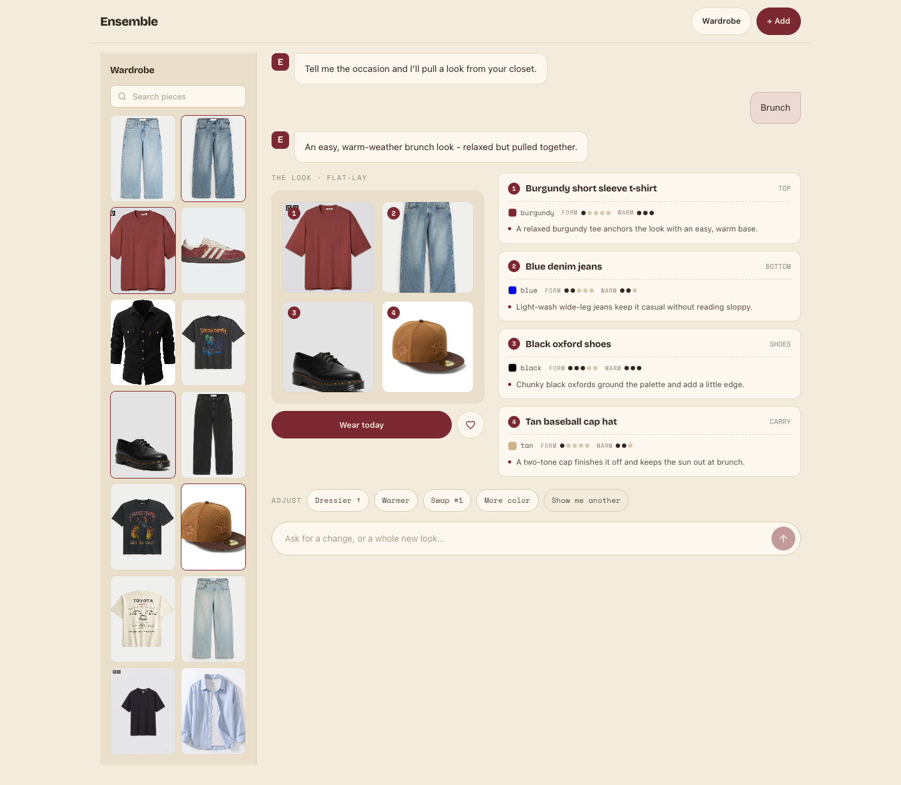
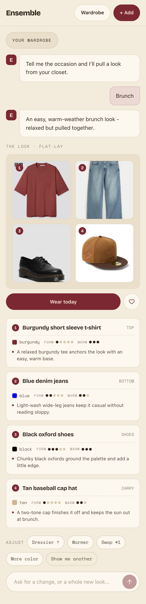

# Task 05 Proofs — Chat stream, flat-lay result, spec list & chips

## Task Summary

This task builds the full stylist screen to handoff option **2a**: a conversational chat stream, a
composer, quick-start + adjust chips, a wardrobe drawer, and the `OutfitResult` — a numbered
flat-lay tray beside a per-piece spec list (derived name, slot label, color swatch, FORM/WARM pips,
and the stylist's rationale). All prior stylist behavior is preserved: multi-turn history / re-pick,
the wear-log with its lock + retryable error, empty/too-small, loading ("thinking"), and
error→retry — now driven through the chat UI. Name/slot/swatch/pips are derived in code
(`lib/specSheet`); only the rationale + whole-look reason are LLM text.

## What This Task Proves

- **Components (FR U3 stream/result/spec-list):** `RatingPips`, `WardrobeDrawer`, `OutfitResult` built and unit-tested.
- **Chat + chips (FR U3 chips/stream/behavior):** quick-start and adjust chips each fire a styling turn; the stream appends user + assistant turns; empty/loading/error states render; re-pick threading preserved.
- **Handoff 2a fidelity (Success Metric 2):** desktop two-pane and mobile-first stack match the handoff (tokens, layout, pips, chips).
- **Deterministic split held:** the flat-lay/spec sheet derive name/slot/swatch/pips from stored tags; the model supplies only rationale text.
- **No regression (Success Metric 3):** full suite green; tsc + lint clean.

## Evidence Summary

- Component suites pass: `RatingPips` (6), `WardrobeDrawer` (6), `OutfitResult` (8), rebuilt `Stylist` (17).
- `specSheet` extended to the real vision-tagger vocabulary (`t-shirt`/`T-Shirt`/`footwear`/`hat`/`cap`) — 40 tests.
- Full frontend suite: **15 files / 160 tests**; `tsc -b` and `eslint` clean.
- Desktop + mobile screenshots show the built screen with **real wardrobe photos** and an enriched spec sheet.

## Artifact: Component + rebuilt-route unit tests

**What it proves:** every new component and the rebuilt route behave to spec — pip fill counts, drawer list/highlight/search, spec-card rendering + wear-today, and the whole chat/re-pick/wear-log/empty/error flow.

**Command:**

~~~bash
cd frontend && npx vitest run src/components/RatingPips.test.tsx src/components/WardrobeDrawer.test.tsx src/components/OutfitResult.test.tsx src/routes/Stylist.test.tsx
~~~

**Result summary:** 37/37 across the four suites (6 + 6 + 8 + 17).

## Artifact: Full frontend suite + typecheck + lint

**Command:**

~~~bash
cd frontend && npx tsc -b && npm run lint && npm run test -- --run
~~~

**Result summary:** tsc + eslint exit 0; whole suite green.

~~~text
=== TSC ===   TSC_EXIT: 0
=== LINT ===  LINT_EXIT: 0
 ✓ src/lib/specSheet.test.ts (40 tests)
 ✓ src/components/RatingPips.test.tsx (6 tests)
 ✓ src/components/WardrobeDrawer.test.tsx (6 tests)
 ✓ src/components/OutfitResult.test.tsx (8 tests)
 ✓ src/routes/Stylist.test.tsx (17 tests)
 Test Files  15 passed (15)
      Tests  160 passed (160)
~~~

## Artifact: Wide-viewport stylist screen (handoff 2a)

**What it proves:** the desktop two-pane screen matches the handoff — a wardrobe drawer (real photos, in-look tiles outlined) beside a chat stream, a `THE LOOK · FLAT-LAY` tray of numbered real-photo tiles, a `Wear today` action + heart, a spec list (one card per piece: number, derived name, slot label, color swatch + name, FORM/WARM pips, rationale), the adjust chips, and the composer.

**Why it matters:** this is the headline screen the whole issue delivers; fidelity to 2a is Success Metric 2.

**Artifact path:** `docs/specs/20-spec-stylist-screen-redesign/20-proofs/assets/05-stylist-desktop.png`

**Result summary:** a real "Brunch" look renders — Burgundy short sleeve t-shirt (TOP), Blue denim jeans (BOTTOM), Black oxford shoes (SHOES), Tan baseball cap hat (CARRY) — each with a swatch, FORM/WARM pips, and a one-line rationale.

## Artifact: Narrow-viewport stylist screen

**What it proves:** the same screen stacks mobile-first — the drawer collapses behind the `YOUR WARDROBE` toggle, the flat-lay tray and spec cards stack full-width, and the chips + composer remain usable.

**Artifact path:** `docs/specs/20-spec-stylist-screen-redesign/20-proofs/assets/05-stylist-mobile.png`

**Result summary:** the full look renders stacked on an iPhone-14 viewport with the drawer collapsed.

## Note on the screenshot backend + fixes found via live testing

Driving the real app surfaced three issues, all fixed here (with tests):

1. **`slotForCategory` vocabulary:** the live vision tagger emits `t-shirt` / `T-Shirt` / `Footwear` / `hat`, which the task-3 map didn't cover (they degraded to `PIECE`). Extended the map (+ tests) so real categories resolve to `TOP`/`SHOES`/`CARRY`.
2. **`OutfitResult` robustness:** a legacy/degraded response missing `rationale` white-screened the component (`rationale.trim()` on `undefined`). Made it defensive (`(rationale ?? '').trim()`) + added a test.
3. **Two-pane width:** `#root` capped the whole app at a phone-width `30rem`, crushing the desktop spec list. Added `#root:has(.stylist-layout)` to widen only the stylist landing; other screens stay phone-width.

**Screenshot data source (disclosure):** the running local backend was a **stale pre-enrichment build** whose `/api/style` returned only `{itemId, photoUrl}` (no tags/rationale), so I did **not** restart the user's server. For the screenshots the enriched `/api/style` response was served by a **temporary Vite dev middleware** (since reverted — `git diff frontend/vite.config.ts` is empty) returning a canned look built from **real wardrobe item ids**; the flat-lay/drawer **photos are real** (proxied from the backend). The enriched contract itself is covered end-to-end by the backend tests in task 2 and the client/helper tests here.

## Reviewer Conclusion

The stylist screen is built to handoff 2a with real photos and an enriched, deterministically
rendered spec sheet, preserving every prior behavior; 160 frontend tests, typecheck, and lint are
green. Live testing also hardened the deterministic helpers and layout. This completes the spec's
implementation phase.
